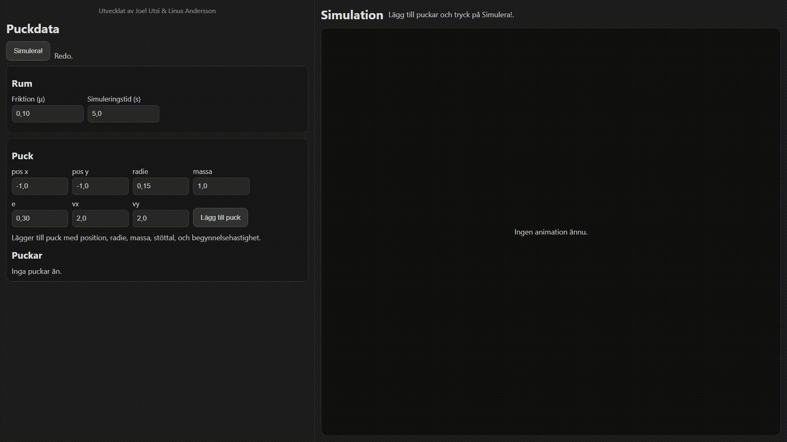

# testing_linus_assignment

This repository generates a GitHub Pages website which simulates simple 2D collision in the plane. This is part of an on-going course development initiative at the V-programme which aims to introduce digitalisation and programming at the V-programme. The source code has been developed by **Joel Utsi and Linus Andersson** and is entirely open source.

The website can be found at: https://joelu2001.github.io/testing_linus_assignment/

## Instructions:

- Set the room attributes and add pucks in the left menu
- Press *Simulera!* when ready.
- View the simulation to the right!

## Examples:

- 2 pucks colliding head on without friction

- 2 pucks colliding head on with friction

- 3 pucks colliding with friction

